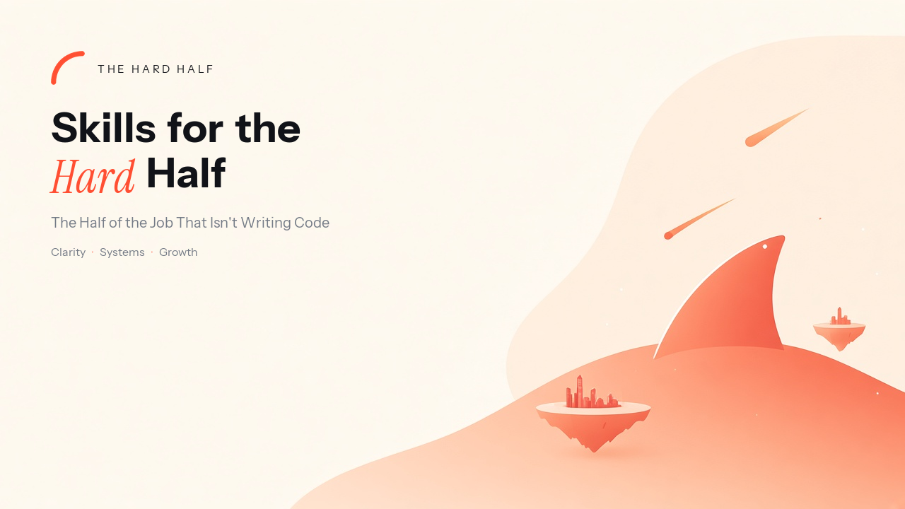

<picture>
  <source media="(prefers-color-scheme: dark)" srcset="assets/banner-dark.png">
  
</picture>

# The Hard Half

### Skills for the half of the job that isn't writing code

[](https://skills.sh/mmoranodevelop/hard-half)

Ask a coding agent a hard question and it retrieves the consensus answer. That is what it is good at — consensus is what its training data is dense in.

On a problem that is genuinely stuck, **the consensus answer is the thing that is stuck.** Retrieval, applied where retrieval has already been tried, returns the wall.

These skills are the other half of the work: the decision, the ticket, the room, the number, the no. Small enough to read in ten minutes, disagree with, edit, and compose. Every one states when *not* to use it, and hands you back the wheel.

<!--
  EMAIL CAPTURE — uncomment when the list URL is real. A dead link costs more than no link.

> **Get new skills as they ship** — [subscribe](https://YOUR-LIST-URL)
-->

## Installation (30-second setup)

Two relationships with the files. **The Claude plugin** installs a managed, read-only bundle that updates when the catalog ships — chat, Cowork, and Claude Code. **[skills.sh](https://skills.sh/mmoranodevelop/hard-half)** copies editable files into your project, so you can hack on them. Pick one: installing both leaves you with every skill twice.

This catalog is not in Anthropic's official store. Add the GitHub repo as a marketplace, then install the plugin.

### Claude chat and Cowork

1. Open **Customize → Plugins**. In Cowork, open the Cowork tab first.
2. In Personal plugins: **+ → Add marketplace → Add from a repository**.
3. Paste `mmoranodevelop/hard-half` (or `https://github.com/mmoranodevelop/hard-half`).
4. Install **The Hard Half**.

Do not paste `/plugin` into a chat. That command is Claude Code only and adds nothing here.

Paid plans (Pro, Max, Team, Enterprise). Skills need *Code execution and file creation* on (`Settings → Capabilities`, or org Skills settings on Team/Enterprise). Type `/` or `+` in the composer to invoke one — not `/hard-half:find-skill`.

One skill without the plugin: zip its folder and upload it under **Customize → Skills → + → Create skill → Upload a skill**.

### Claude Code

```bash
claude plugin marketplace add mmoranodevelop/hard-half
claude plugin install hard-half@hard-half
```

Or inside a session: `/plugin marketplace add mmoranodevelop/hard-half` then `/plugin install hard-half@hard-half`.

### Codex, Cursor, and everyone else

```bash
npx skills@latest add mmoranodevelop/hard-half
```

Pick the skills you want, and which agents to install them on. Preview first with `--list`. Take everything, everywhere, with `--all`.

Codex also has a native marketplace entry:

```bash
codex plugin marketplace add mmoranodevelop/hard-half
```

Don't browse two hundred files. Tell the agent the situation:

```
I need the skill for [the room / the artifact / the decision].
```

[`find-skill`](skills/productivity/find-skill/SKILL.md) names the one that owns that job — and the two neighbours it is not.

These follow the [Agent Skills](https://agentskills.io) open standard. [A lot of clients load them](https://agentskills.io/clients): Claude Code, Claude chat and Cowork, ChatGPT and Codex, Cursor, GitHub Copilot, Gemini CLI, Amp, OpenCode, Goose, and others. Claude and Codex have a plugin store. Everywhere else is a directory: `~/.agents/skills/` (user) and `.agents/skills/` (project). The CLI writes there.

| | Plugin (Claude / Codex) | `skills` CLI |
|---|---|---|
| **What happens** | A **managed bundle** | Files are **copied** into your project |
| **Editing** | Read-only, always current | Yours. Fork it |
| **Updates** | Automatic / marketplace | `npx skills update` |
| **Invocation** | Chat/Cowork: `/` or `+`. Code: `/hard-half:find-skill` | `/find-skill` |
| **Choose it when** | You want them to just work | You will make them yours |

## Five failures these are for

### 1. We shipped the fix. Monday didn't change.

The stated problem was a ghost — a proxy metric, a war that already ended, a slogan nobody can source. Prove it is load-bearing, or name the problem whose death would make this one evaporate.

→ [`ghost-problem`](skills/problem-solving/ghost-problem/SKILL.md)

### 2. Seven things are on. Nothing is moving.

Cut to the 3–5 items that move the mission in the next 18 hours. Everything else gets a disposition: delegated, deferred, batched, or deleted.

→ [`signal-vs-noise`](skills/productivity/signal-vs-noise/SKILL.md)

### 3. The status update didn't decide anything.

One page, one ASK, the exception — not a diary of activity. For a board or a CEO, the sibling is a decision memo, not a longer status.

→ [`weekly-status`](skills/project/weekly-status/SKILL.md) · [`executive-board-memo`](skills/management/executive-board-memo/SKILL.md)

### 4. A client email became a messy ticket.

Read the list's live fields. Bind type, size, and dates to real option IDs. Don't invent the schema.

→ [`client-ticket`](skills/project/client-ticket/SKILL.md)

### 5. I wrote a skill and the agent never uses it.

The `description` is a routing rule, not a title. Write it first. Test the three nearest requests that must stay silent.

→ [`create-skill`](skills/productivity/create-skill/SKILL.md)

## The catalog

Skills divide on one axis: **who can invoke them.**

- **Model-invoked** — you or the agent, when the task matches. Reusable discipline.
- **User-invoked** — only by typing the name. Orchestration, or a write whose timing you must own.

A user-invoked skill may call model-invoked ones, never another user-invoked one.

On disk: `skills/<category>/<name>/`. Each bucket has a `README.md`. [`find-skill`](skills/productivity/find-skill/SKILL.md) walks those indexes.

| Bucket | Skills | Open when |
|---|---:|---|
| [problem-solving](skills/problem-solving/README.md) | 8 | Stuck, wrong problem, gamed metric, unsolved claim |
| [productivity](skills/productivity/README.md) | 9 | Find a skill, write a skill, calendar, WIP |
| [project](skills/project/README.md) | 38 | Charter to close, status, tickets, go-live |
| [management](skills/management/README.md) | 32 | Board, people, RAID, operating rhythm |
| [strategy](skills/strategy/README.md) | 23 | Case, price, market, kill criteria |
| [accounts](skills/accounts/README.md) | 10 | Named account, renewal, save |
| [commercial](skills/commercial/README.md) | 9 | Bid, desk, forecast, channel |
| [comms](skills/comms/README.md) | 20 | Rooms that decide, spoken and written |
| [delivery](skills/delivery/README.md) | 11 | Capacity, SLA, launch, leakage |
| [finance](skills/finance/README.md) | 10 | Cash, close, capital |
| [documents](skills/documents/README.md) | 11 | PRD, proposal, deck, workbook |
| [writing](skills/writing/README.md) | 10 | Voice, memo, conversation |
| [branding](skills/branding/README.md) | 5 | Bio, positioning, calendar |
| [learning](skills/learning/README.md) | 5 | Turn a source into a method |
| [mergers-acquisitions](skills/mergers-acquisitions/README.md) | 20 | Day-1, TSA, talent, brand after close |

## Design principles

1. **The `description` is a routing rule, not a title.** What it does, when to use it, when *not* to. A skill that fires on the wrong task is how the whole set gets uninstalled.
2. **Progressive disclosure.** The body is every run. Depth lives in `references/` and loads on demand.
3. **Explain why, don't just command.** Instructions that carry their reasoning survive situations the author didn't imagine.
4. **Say when to stop.** Every skill can conclude it is the wrong tool.
5. **Falsifiable output.** If nothing it produces could be shown wrong, it produced rhetoric.
6. **Names say the job.** `create-skill`, `find-skill`, `weekly-status` — not adjectives.

The craft in `create-skill` (leading words, information hierarchy, no-op test) is adapted from [`writing-great-skills`](https://github.com/mattpocock/skills) by Matt Pocock (MIT).

## Contributing

See [CONTRIBUTING.md](CONTRIBUTING.md). Skills come from work actually done. CI enforces the frontmatter contract. The plugin slug `hard-half` is immutable.

Repo conventions: [AGENTS.md](AGENTS.md). Shared vocabulary: [CONTEXT.md](CONTEXT.md).
